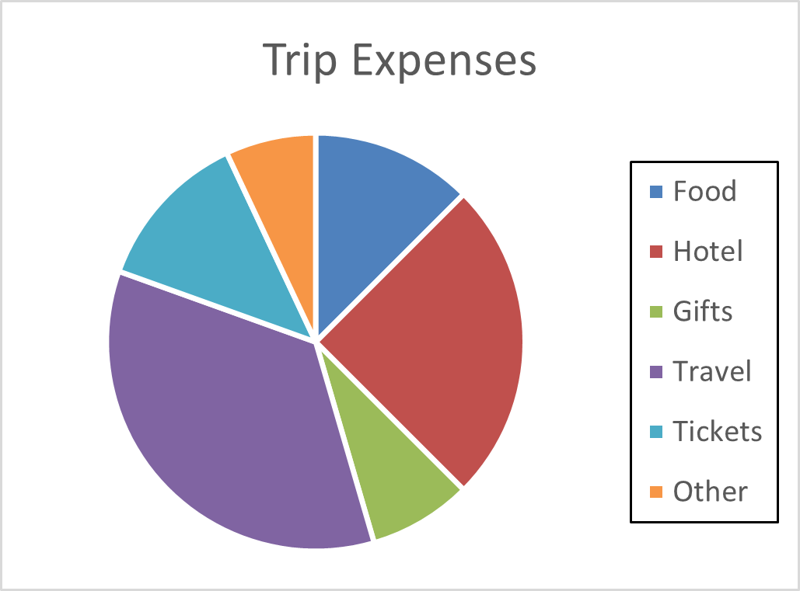
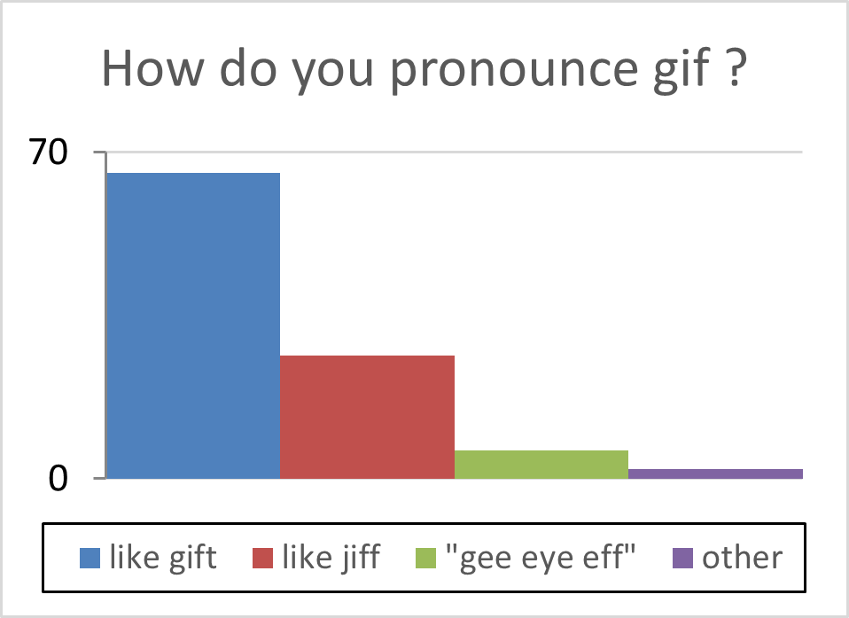

# Reading and Interpreting Statistical-Chart

## Main Idea

Statistical charts are used to represent statistical data in visual form. One of the most used statistical charts is the
**Bar chart** which presents categorical data with rectangular bars of heights proportional to the values that they
represent. **Pie charts** are also used Sometimes to illustrate numerical proportions. In pie charts each proportion is
represented by a slice from the circular shape.

Interpreting such charts visually may not produce an accurate results. And if there are a multiple number of charts then
it will be exhaustive to interpret them one by one. In this application, will interpret statistical charts and extract
information from them programmatically. Given an image that contains a statistical chart and the color of each category
(i.e. legend), your program should extract statistical information in a textual from.

## **Result**

**1. Pie Chart**

- _Input Chart:_ 

- _Output Text:_

  Food: 12.5%

  Hotel : 25%

  Gifts : 8%

  Travel : 35%

  Tickets: 12.5%

  Other : 7%

**2. Bar Chart**

- _Input Chart:_ 

- _Output Text:_

  Like gift : 65.6

  Like jiff : 26.4

  "gee eye eff" : 6

  Other : 2
